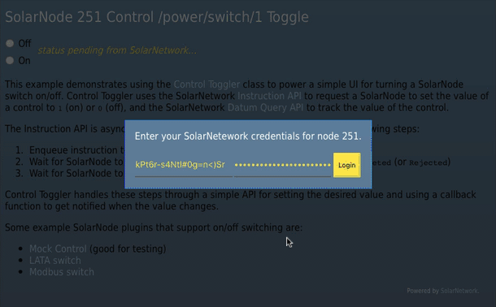

# SolarNetwork Control Toggle Example

This project contains a webapp that uses the [ControlToggler][sn-control-toggler] class
to manage a switch attached to a SolarNode between on/off states. See the 
[API Developer Guide][solarnet-api] for more information.



This video is also available at [full size](https://youtu.be/BW3Y3_PEj-k).

## Building

The build uses [NPM][npm] or [Yarn][yarn]. First, initialize the dependencies:

```shell
# NPM
npm install

# or, Yarn
yarn install
```

Then, the development web server can be started via

```shell
# NPM
npm run start

# or, Yarn
yarn run start
```

and then the app can be reached at [localhost:9000](http://localhost:9000). For a
produciton build, use

```shell
# NPM
npm run build -- --config webpack.prod.js

# or, Yarn
yarn run build -- --config webpack.prod.js
```

and the app will be built in the `dist` directory.

  [npm]: https://www.npmjs.com/
  [yarn]: https://yarnpkg.com/
  [solarnet-api]: https://github.com/SolarNetwork/solarnetwork/wiki/API-Developer-Guide
  [sn-control-toggler]: https://github.com/SolarNetwork/sn-control-toggler-js
