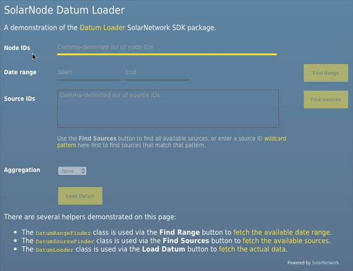

# SolarNetwork Datum Loader Example

This project contains a webapp that uses the [Datum Loader][sn-datum-loader]
package to query for datum. See the [API Developer Guide][solarnet-api] for more
information, especially the [SolarQuery guide][solarquery-api].



This video is also available at [full size](https://youtu.be/otQJynw4bMI).


## Building

Development server can be run via

```shell
npm run start
```

and then the app can be reached at [localhost:9000](http://localhost:9000). For a
produciton build, use

```shell
npm run build -- --config webpack.prod.js
```

and the output will be in the `dist` directory.

  [solarnet-api]: https://github.com/SolarNetwork/solarnetwork/wiki/API-Developer-Guide
  [solarquery-api]: https://github.com/SolarNetwork/solarnetwork/wiki/SolarQuery-API
  [sn-datum-loader]: https://github.com/SolarNetwork/sn-datum-loader-js
