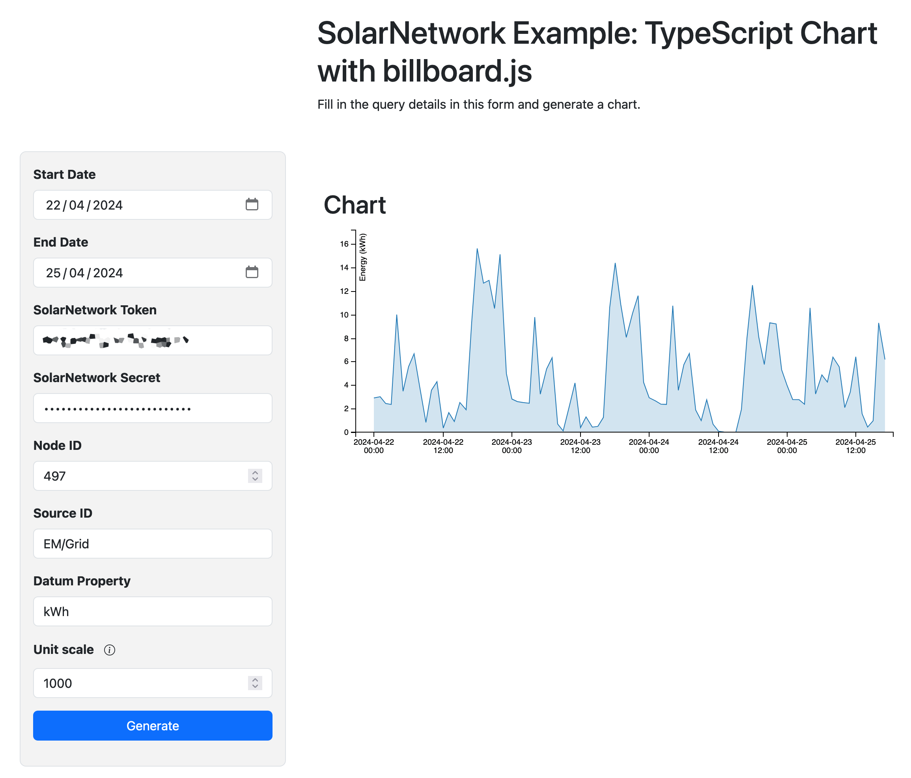

# SolarNetwork Example: TypeScript Chart with billboard.js

This project is a little web app to show the basics of using the SolarNetwork TypeScript API
along with the billboard.js project to generate a chart out of a SolarNetwork datum stream.

<https://go.solarnetwork.net/dev/example/typescript-chart-billboard/>



# Building from source

To build yourself, clone or download this repository. You need to have
Node 16+ installed. Then:

```sh
# initialize dependencies
npm ci

# run development live server on http://localhost:8080
npm run dev

# build for production
npm run build
```

Running the `build` script will generate the application into the `dist/` directory.
